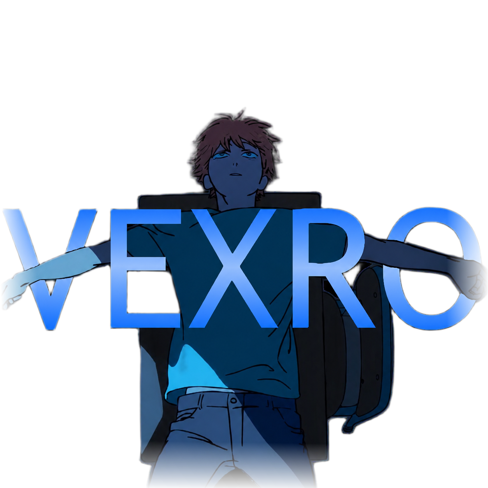

<p align="center">
  
</p>
<h1 align="center">Vexro Emotes</h1>
<p align="center">
  A modern Roblox emote system with 40,000+ emotes, multilingual support, themes, favorites, keybinds, combos and friend sync.
</p>
<p align="center">
  
  
  
</p>
---
Overview
Vexro Emotes is a modern emote system designed for Roblox R15 characters.
It includes a large emote database, multilingual support, theme customization, favorites, keybinds, combo playback, friend sync and an in-game HUD.
> **Note:** Vexro Emotes currently supports **R15 characters only**.
---
Features
40,000+ Emotes  
Large emote database based on Roblox catalog data.
Multilingual Support  
Turkish, English, Spanish, Arabic, French, Hindi, Portuguese and Russian.
Themes  
Dark, Purple, Blue, Green, Red, Light, MaterialYou, FrostedGlass and DarkGlass.
Favorites  
Save up to 25 favorite emotes.
Recent Emotes  
Keeps the last 20 used emotes.
Keybinds  
Assign shortcut keys to emotes.
Combo System  
Play multiple emotes in sequence.
Friend Sync  
Sync and play emotes together with friends.
Emote HUD  
Control the current emote while it is playing.
Speed Control  
Adjust emote speed between 0.1x and 2x.
Loop Mode  
Repeat an emote continuously.
Stop on Movement  
Automatically stop emotes when the character moves.
Copy Emote  
Copy another player's currently playing emote.
Respawn Support  
Continue the last emote after respawn.
---
Project Structure
```txt
Vexro/
├─ assets/
│  └─ vexro.png
├─ src/
│  ├─ vexroemotes.lua
│  ├─ vexrohub.lua
│  ├─ vexroavatar.lua
│  ├─ RunYourRestaurant_AutoCollect.lua
│  ├─ ui/
│  │  ├─ vexroUI.lua
│  │  ├─ vexrouilib.lua
│  │  ├─ vexronotificationblack.lua
│  │  └─ vexroredzlibrary.lua
│  └─ language/
│     ├─ vexrolanguagelib.lua
│     └─ vexrolanguageselection.lua
├─ data/
│  ├─ emotes.json
│  └─ AnimationSniper.json
└─ legacy/
   ├─ vexroaimlocktriggerbot.lua
   └─ vexroreach.lua
```
---
Main Files
File	Description
`src/vexroemotes.lua`	Main emote system
`src/vexrohub.lua`	Hub / menu entry point
`src/vexroavatar.lua`	Avatar-related system
`src/RunYourRestaurant_AutoCollect.lua`	Separate utility module
`src/ui/vexroUI.lua`	UI components
`src/ui/vexrouilib.lua`	Vexro UI library
`src/ui/vexronotificationblack.lua`	Notification UI
`src/ui/vexroredzlibrary.lua`	Red'z UI library integration
`src/language/vexrolanguagelib.lua`	Language library
`src/language/vexrolanguageselection.lua`	Language selection screen
`data/emotes.json`	Emote database
`data/AnimationSniper.json`	Animation package data
`assets/vexro.png`	Project logo
`legacy/`	Older or separate modules
---
Installation
Clone the repository:
```bash
git clone https://github.com/zyrovell/Vexro.git
```
Open the project folder and use the needed files from the `src/` directory.
---
Requirements
Roblox R15 character
Lua-compatible environment
Updated data files from the `data/` folder
---
Developer
Zyrovell
Discord: `_ege.`
Roblox: `Oyuncu15q`
---
Responsible Use
This project is shared for learning, development and personal use.
Please use it responsibly and follow Roblox's Community Standards, platform rules and the rules of each experience.
---
License
This project is open source.
You may use, modify and share it while respecting the rules of the platforms where it is used.